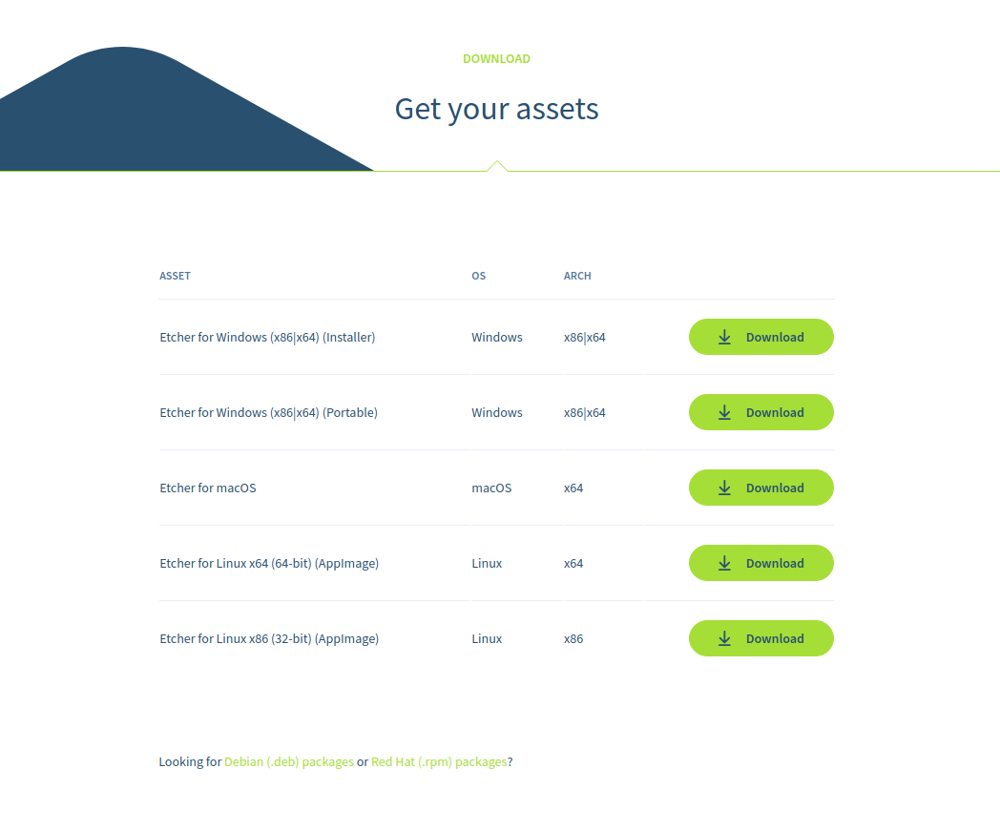
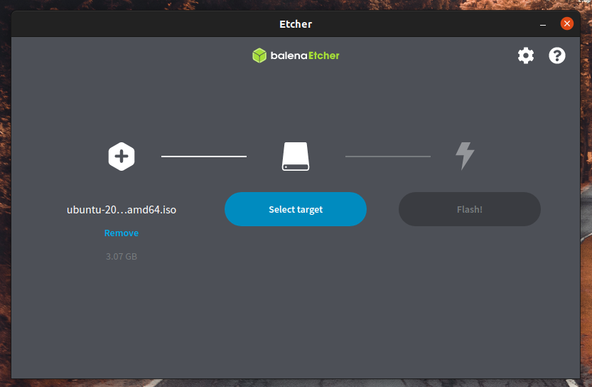
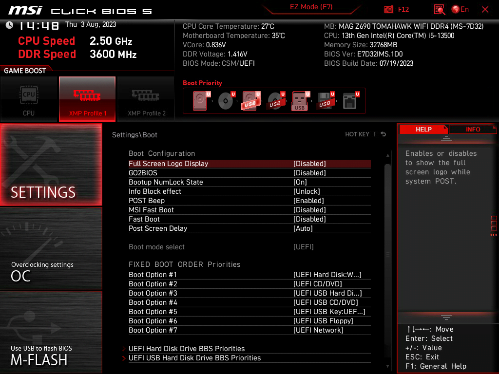
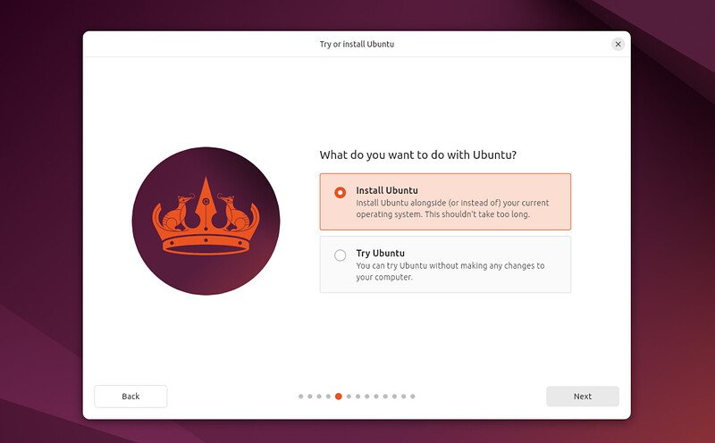
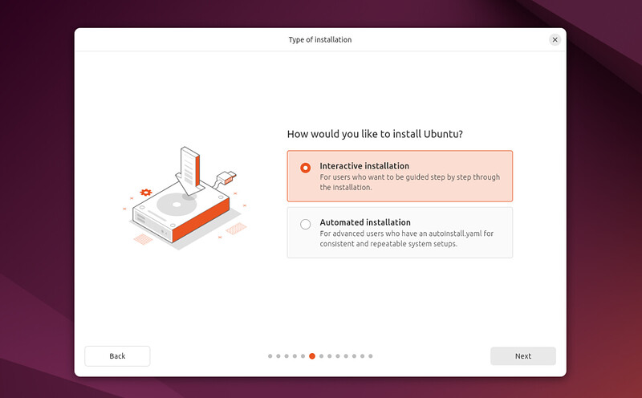
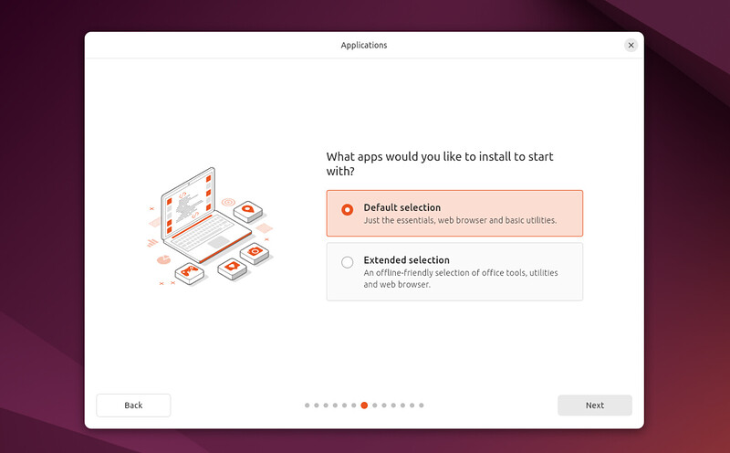
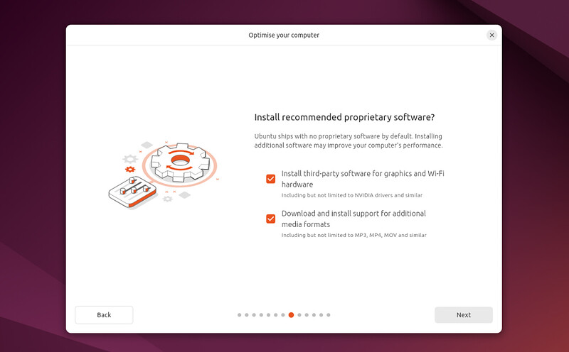
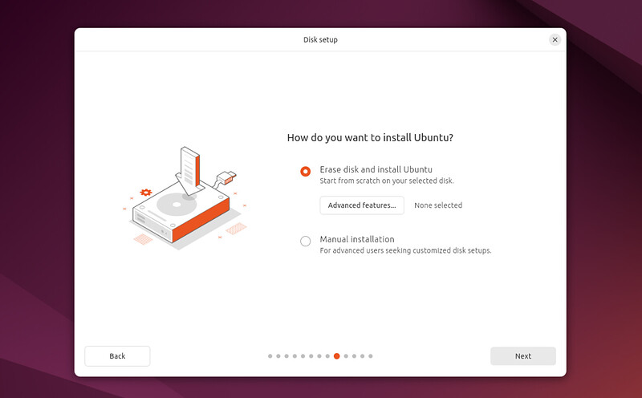
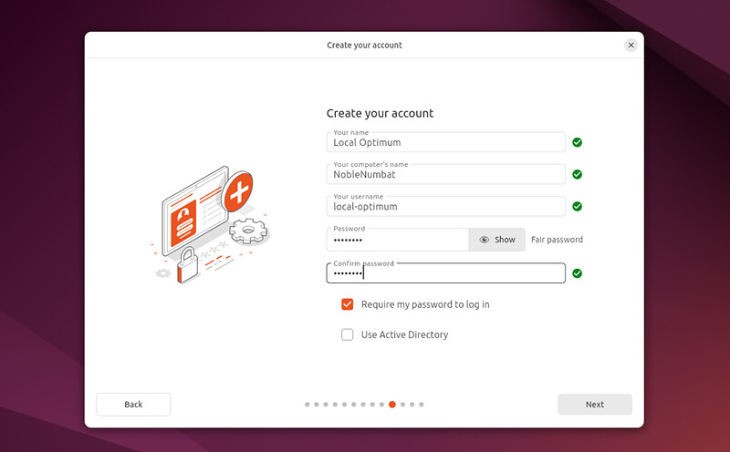

# Ubuntu Desktop Installation Guide

## Overview
This guide details how to install Ubuntu Desktop using a USB flash drive.

## Requirements
- **A computer/laptop** with a minimum of 25GB of storage.
- **USB stick** with at least 8GB capacity.
- **Ubuntu ISO** file, available for download [here](https://ubuntu.com/download/desktop).

## Step 1: Create a Bootable USB Stick

1. **Download the Ubuntu ISO:** Obtain the latest version of Ubuntu Desktop from the [official website](https://ubuntu.com/download/desktop).
2. **Install USB creation software:** Download and install [Balena Etcher](https://www.balena.io/etcher/).<br>
[](images/create-bootable-usb.png)<br>

3. **Flash the ISO to the USB stick:** Open Etcher and select the downloaded ISO file. Choose the USB drive and click "Flash" to write the image.<br>
[](images/select-iso.png)<br>

## Step 2: Boot from USB

1. **Insert the USB drive** into your target PC.
2. **Reboot the computer** and access the boot menu. This usually involves pressing keys like `F12`, `Esc`, or `Delete` during startup.
3. **Select the USB drive** as the boot source.<br>
[](images/msi_boot_screen.png)<br>

## Step 3: Install Ubuntu Desktop

1. **Set your preferred language** and click "Continue."<br>
[](images/installation-screens-1.jpeg)<br>

2. **Connect to the internet:** Choose a Wi-Fi network or skip this step for offline installation.<br>
[](images/installation-screens-4.jpeg)<br>

3. **Welcome screen:** Choose "Try Ubuntu" or "Install Ubuntu."<br>
[](images/installation-screens-5.jpeg)<br>
[](images/final-steps-1.jpeg)<br>
[](images/final-steps-2.jpeg)<br>

5. **Software:** Install recommended or proprietry software.<br>
[](images/final-steps-3.jpeg)<br>

6. **Installation type:** Choose between "Erase disk and install Ubuntu" or "Install Ubuntu alongside" an existing OS for dual-boot.<br>
[](images/partition.jpeg)<br>

7. **Partition setup:** Customize partitions if needed, otherwise proceed with the default settings.<br>
[](images/post-installation-2.png)<br>
[](images/post-installation-1.png)<br>

8. **Create login credentials:** Enter your name, computer name, username, and password.<br>
[](images/conclusion-1.jpeg)<br>

## Step 4: Complete the Installation

1. **Review the installation details** and click "Install Now."<br>
[](images/conclusion-3.jpeg)<br>
2. **Wait for the installation to finish** and click "Restart Now" when prompted.<br>
[](images/conclusion-5.jpeg)<br>

3. **Remove the USB stick** during reboot to boot into the newly installed Ubuntu system.

## Step 5: Post-Installation Steps

1. **Log in** with the username and password you created.
2. **Update your system** by running the following commands:
   ```bash
   sudo apt update && sudo apt upgrade
   ```

For more detailed information, visit the full tutorial [here](https://ubuntu.com/tutorials/install-ubuntu-desktop#1-overview).
